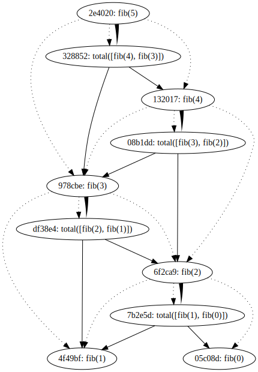

# Caf — Distributed calculation framework

```python
import caf2 as caf

@caf.Rule
def total(xs):
    return sum(xs)

@caf.Rule
def fib(n):
    if n < 2:
        return n
    return total([fib(n-1), fib(n-2)])

with caf.Session() as sess:
    sess.eval(fib(5))
    dot = sess.dot_graph(format='svg')
dot.render('test.gv', view=True)
```


